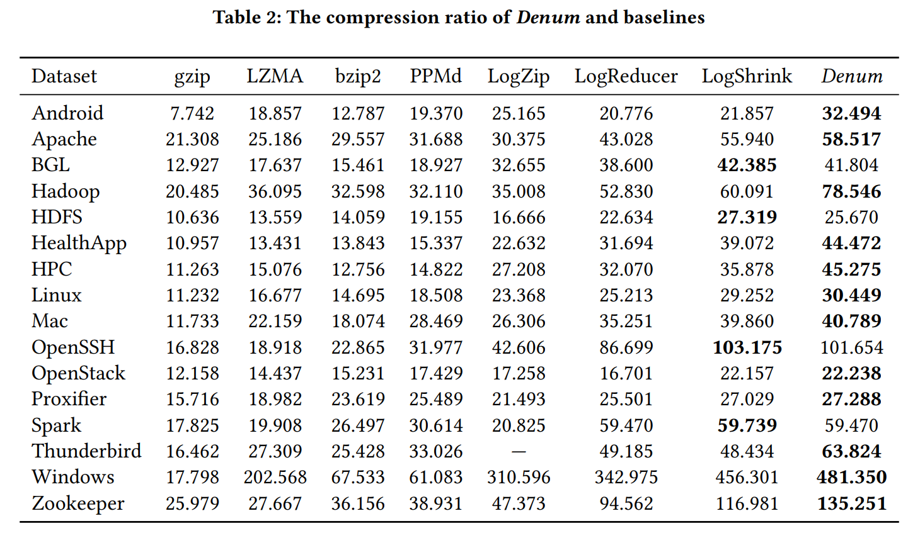
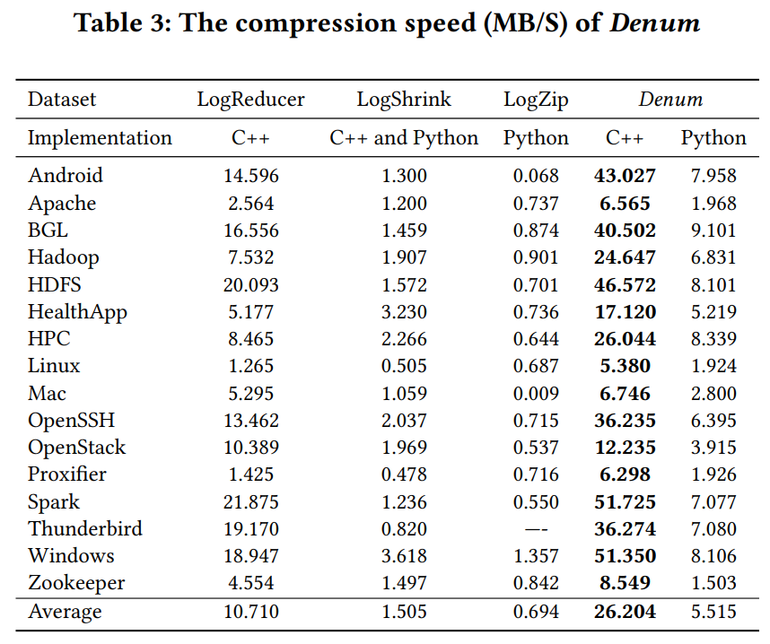
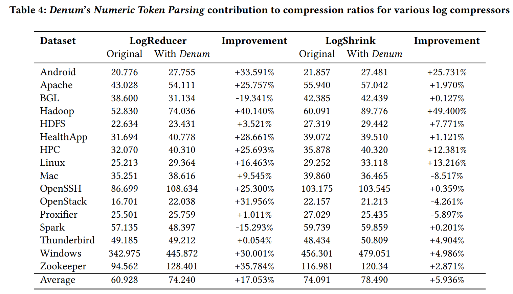
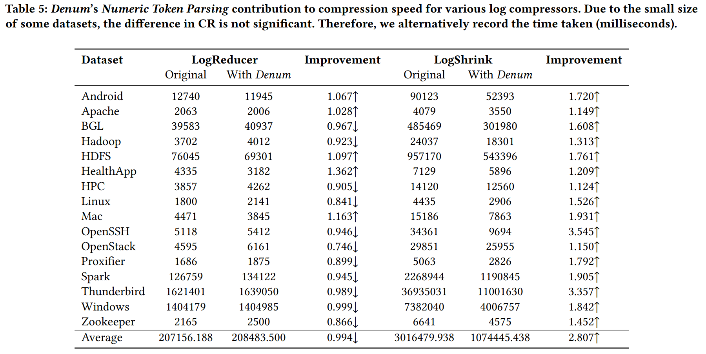
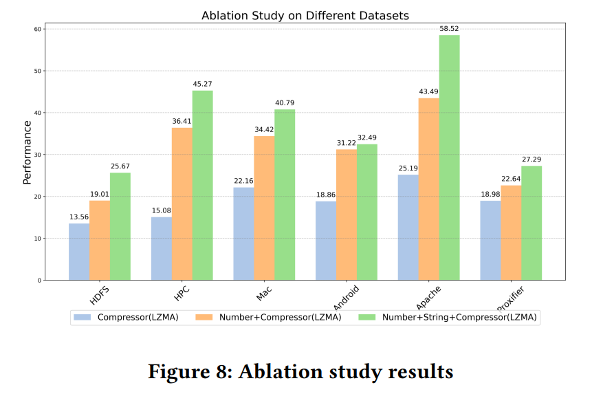
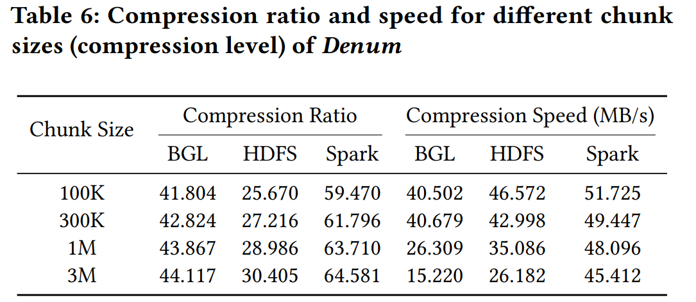

# Denum
## Unlocking the Power of Numbers: Log Compression via Numeric Token Parsing
accepted by the 39th IEEE/ACM International Conference on Automated Software Engineering (ASE 2024)

##### Dataset

Loghub: 

https://github.com/logpai/loghub

download these datasets and copy them into Logs/{logname}/{logname}.log

### Compress

###  - C++ implementation

##### Dependencies

python >= 3.7.3

regex = 2012.1.8

gcc >= 9.4.0

PCRE2 = 10.34

libboost-iostreams-dev = 1.71.0.0ubuntu2

In our environment with gcc, we used the following two commands to complete the configuration of the experimental environment: 

1. ` apt install libpcre2-dev` 2. `apt install libboost-iostreams-dev`

##### 1. Compile

`g++ -O3 -std=c++17 -o denum_compress denum_compress.cpp -lboost_iostreams -lpthread -lpcre2-8`

#### 2. Execution

Assume the chunksize is set to 100000, and the target log file is Logs/HDFS/HDFS.log

`./denum_compress HDFS 100000 1`

This repository contains Apache log file, you can run this directly without dataset downloading
`./denum_compress Apache 100000 1`

The last parameter is used to facilitate the retrieval of experimental results for each RQ: "1" indicates the default Denum, "2" indicates that logs will be output without numbers, used for RQ3, and "3" indicates Denum without string processing, used for RQ4.

### - Python implementation

Assume the target log file is Logs/Apache/Apache.log

1. `cd Denum_Package`

2. `python3 compress.py Apache`

### Decompress

Note that datasets using different tags may encounter errors during decompression. We have only designed the recovery of the 
IP address for Apache decompression. When applied to specific tags in specific datasets, users may need to mimic the function 
of line809 to design recovery functions. This is because although the IPaddress mode is<\*>.<\*>.<\*>.<\*>, The number represented 
by<\*>may be 1-3, so we will fill it with 0 and remove the high-order 0 during decompression. For example, the value of 1.1.1.1 
during compression is 001001001. Users need to pay attention to the changes in the number of numbers represented by<\*>in the tag

1. `cd Denum_Package`

2. `python3 decompress.py Apache`

### Lossy Check

1. `cd ..`

2. `python3 lossy_check.py`

### Docker

1. `docker pull docker.io/gaiusyu/denumv1.0:latest`
2. `docker run -v /Your/Path/to/Logs:/app/Logs -v /Your/Path/to/output:/app/output -v /Your/Path/to/decompress_output:/app/decompress_output -it denumv1.0 {logname} {chunksize} {stage}`
3. Example to start a container: `docker run -v E:/CUHKSZ/Denum_ASE2024/Logs:/app/Logs -v E:/CUHKSZ/Denum_ASE2024/output:/app/output -v E:/CUHKSZ/Denum_ASE2024/decompress_output:/app/decompress_output -it denumv1.0 Apache 100000 1`

### Experiments Reproduction

Research questions:

• RQ1: What is the compression ratio of Denum?

• RQ2: What is the compression speed of Denum?

• RQ3: Can Denum’s Numeric Token Parsing module improve
the performance of other log compressors?

• RQ4: How does each module in Denum affect its compression
 ratio?

You can also use **Docker** to replace the execution command below.

### - RQ1 & RQ2

1. Download these datasets and put them into Logs/{logname}/{logname}.log from [loghub](https://github.com/logpai/loghub)

2. Compile the code according to the previous instructions, and then run the following command: `./denum_compress {logname} 100000 1`

3. Perform the above operations for different datasets. 

4. Record CR&CS

Results:

CR

Since CR is unrelated to environment, we sourced the CRs of other compressors directly from the original
papers

CS

5. Reproduce [LogShrink](https://github.com/IntelligentDDS/LogShrink) and [LogReducer](https://github.com/THUBear-wjy/LogReducer) according their instructions.

6. Record CS

### - RQ3
For RQ3, the logs need to undergo Denum's numeric token parsing module, generating logs without numbers, and then applying it to other log compressors.

1. Use mode "2" to generate logs without numbers
`./denum_compress {logname} 100000 2`, `logs without numbers` are saved in /output/{logname}.log

2. Compress `logs without numbers` according to the instructions in other log compressors such as [LogReducer](https://github.com/THUBear-wjy/LogReducer), [LogZip](https://github.com/logpai/logzip) and [LogShrink](https://github.com/IntelligentDDS/LogShrink)

3. Note that the CR and CS output in the second step are not accurate. The compression time should include the time taken to generate logs without numbers. The CR is also incorrect because it is calculated based on logs without numbers. We need to calculate the CR using the achieved size and the original log file size.

Results:

### - RQ4

1. The bar for Compressor(LZMA) is sourced from RQ1
2. The bar for Number+Compressor(LZMA): Use mode "3" to generate CRs `./denum_compress {logname} 100000 3`
2. The bar for Number+String+Compressor(LZMA) is the complete Denum

Results:

### Tradeoff between CR&CS

1. Different parameter setting to achieve this: 100K. `./denum_compress {logname} 100000 1`
300K`./denum_compress {logname} 300000 1` 1m.`./denum_compress {logname} 1000000 1` 3m.`./denum_compress {logname} 3000000 1`

